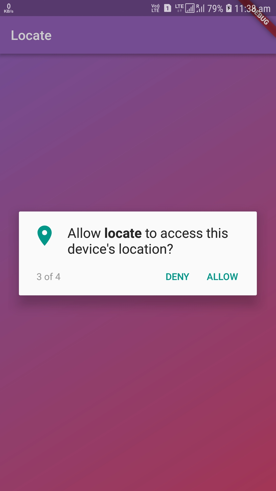
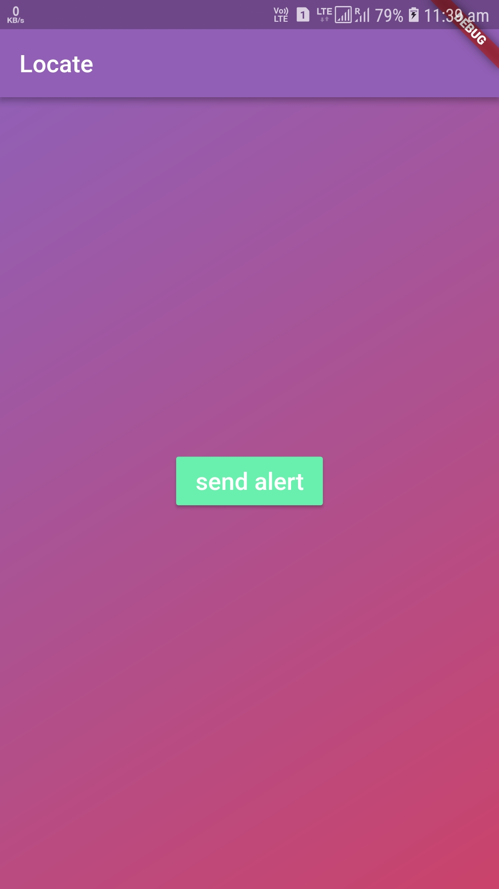
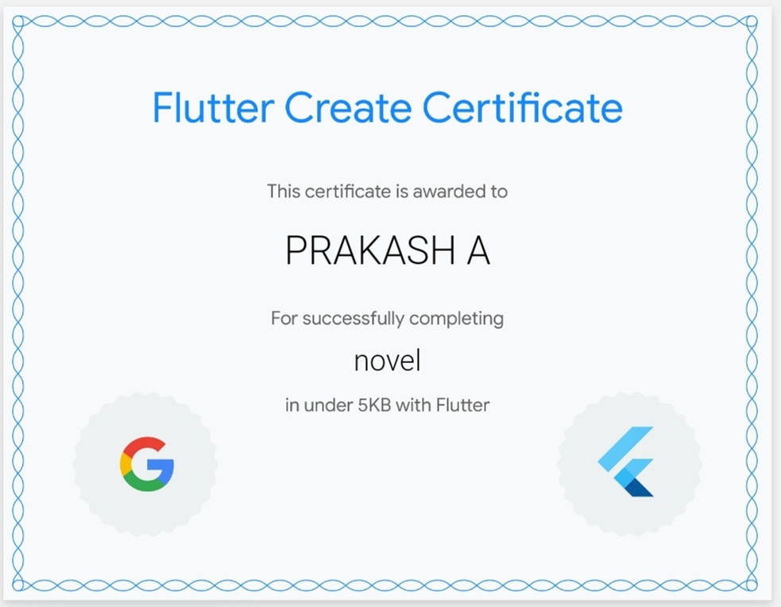

# Locate

Sends continuous location coordinates to call log numbers made specially for Women Safety

## Instructions

extract zip file and move to directory novel by command 'cd novel'
To run the application 'flutter run --release'
key.jks is under directory andriod/app/key

## Getting Started

This project mainly focusing Women Safety.

with single tap, messages are sent continously even when app runs in background. it can send concurrent update when location changes over 100 meters. it will send messages to mobile address from call log over past 2 days. Recievers can locate them using coordinates.

## Flutter Create

[Flutter Create](https://flutter.dev/create) is a contest that challenges you to build something interesting, inspiring, and beautiful with Flutter using 5KB or less of Dart code.Entries will be judged by a panel of Flutter experts against the following four criteria:
* Visual beauty
* Code quality
* Novelty of idea
* Overall execution 

## Screenshots

 

## Certificate

## License
Prakash A – [@iamprakash13](https://github.com/iamprakash13) - [ptan022@gmail.com](ptan022@gmail.com)

Distributed under the MIT License

Copyright (c) 2019 Prakash A

Permission is hereby granted, free of charge, to any person obtaining a copy
of this software and associated documentation files (the "Software"), to deal
in the Software without restriction, including without limitation the rights
to use, copy, modify, merge, publish, distribute, sublicense, and/or sell
copies of the Software, and to permit persons to whom the Software is
furnished to do so, subject to the following conditions:

The above copyright notice and this permission notice shall be included in all
copies or substantial portions of the Software.

THE SOFTWARE IS PROVIDED "AS IS", WITHOUT WARRANTY OF ANY KIND, EXPRESS OR
IMPLIED, INCLUDING BUT NOT LIMITED TO THE WARRANTIES OF MERCHANTABILITY,
FITNESS FOR A PARTICULAR PURPOSE AND NONINFRINGEMENT. IN NO EVENT SHALL THE
AUTHORS OR COPYRIGHT HOLDERS BE LIABLE FOR ANY CLAIM, DAMAGES OR OTHER
LIABILITY, WHETHER IN AN ACTION OF CONTRACT, TORT OR OTHERWISE, ARISING FROM,
OUT OF OR IN CONNECTION WITH THE SOFTWARE OR THE USE OR OTHER DEALINGS IN THE
SOFTWARE.

### Show some :heart: and star the repo to support the project

   

## Documentation

For help getting started with Flutter, view the online
[documentation](http://flutter.io/).

For help on editing plugin code, view the [documentation](https://flutter.io/platform-plugins/#edit-code).
